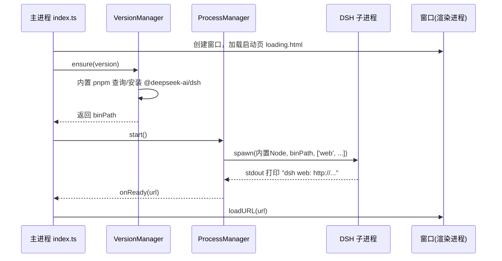

# DeepSeek Harness Desktop 开发指南

给 [DeepSeek Harness（DSH）](https://github.com/deepseek-ai/deepseek-harness) 包一层 Electron 壳的练习项目。本文档说明如何开发、如何运行，以及核心架构。

## 1. 项目是什么

DSH 官方提供 Web UI（命令 `dsh web`），默认跑在 `http://127.0.0.1:3080`。本壳负责三件事，其余一概不碰：

| 职责 | 实现 | 说明 |
|------|------|------|
| 内置 Node.js 运行时 | `node-runtime.ts` | 用 Electron 自带 Node 跑 DSH，用户无需另装 Node |
| 管理官方 DSH 版本 | `version-manager.ts` | 用内置 pnpm 把 `@deepseek-ai/dsh` 按版本装到应用数据目录 |
| 托管本地进程 | `process-manager.ts` | spawn / 就绪探测 / 健康检查 / 异常重启 / 退出回收 |

**核心设计**：页面由 DSH 进程自己 serve，壳只负责把窗口指到就绪后的 URL。因此官方页面怎么升级，壳代码都不用改——适配压力全部收敛在「启动 + 进程管理」这条边界上。

## 2. 环境要求

| 依赖 | 版本 | 用途 |
|------|------|------|
| Node.js | 18+（推荐 20+） | 开发时装项目依赖；`nodeMode=system` 时也用它跑 DSH |
| pnpm | 10+ | 开发时装项目依赖 |

> 终端用户运行成品时**不需要装 Node 或 pnpm**——Node 由 Electron 内置，pnpm 作为项目依赖一并打包（用内置 Node 执行 `pnpm.cjs`）。**开发阶段**首次 `pnpm install` 装项目依赖仍需本机有 pnpm。

## 3. 快速开始（运行）

```bash
cd deepseek-harness-desktop
pnpm install     # 首次：装依赖 + 下载 Electron 二进制
pnpm start       # 编译 TypeScript 并启动 Electron
```

首次启动会自动：

1. 查询 `@deepseek-ai/dsh` 最新版本（`latest`）
2. 用内置 pnpm 把该版本装到 `%APPDATA%/deepseek-harness-desktop/versions/<版本>/`
3. 用 Electron 内置 Node 拉起 DSH（`dsh web`）
4. 捕获就绪地址后，窗口从启动页跳转到 DSH 的 Web UI

### Electron 下载慢

`.npmrc` 已配置国内镜像：

```
electron_mirror=https://npmmirror.com/mirrors/electron/
```

## 4. 开发工作流

```bash
# 只编译（tsc → dist/）
pnpm run build

# 编译并启动（= build + electron .）
pnpm start
```

改代码规则：

- 改 `src/**/*.ts`：需要重新 `pnpm run build`（或直接 `pnpm start`，它先 build）
- 改 `renderer/*.html|css|js`：**无需编译**，直接重启应用即可

### 日常调试小循环

1. 改 TS 源码
2. `pnpm start`
3. 看终端里的 `[dsh]` 日志（DSH 子进程的输出、状态流转）
4. 需要清空重来时删掉数据目录（见 §8）

## 5. 调试

### 5.1 看日志

启动后终端会输出 `[dsh]` 前缀日志：

```
[dsh] starting
[dsh] dsh web: http://127.0.0.1:3080
```

- `[dsh] starting` —— 进程托管器状态流转
- `[dsh] dsh web: ...` —— DSH 子进程打印的就绪信号
- `[dsh] FATAL ...` —— DSH 崩溃（会在启动页显示错误与重试按钮）

### 5.2 看启动页

启动页（`renderer/loading.html`）会展示安装/启动进度和最近日志；出错时提供「重试 / 退出」按钮。

### 5.3 单独验证 DSH（不经过壳）

排查 DSH 本身问题时，可以直接跑官方命令对照：

```bash
npx @deepseek-ai/dsh web --port 3123
```

能起来说明 DSH 没问题，问题在壳的启动/进程管理。

### 5.4 验证端口与进程

```powershell
netstat -ano | findstr LISTENING | findstr :3080
```

## 6. 目录结构

```
deepseek-harness-desktop/
├── package.json           # 依赖与脚本（start/build）
├── tsconfig.json          # TS 编译配置（CommonJS → dist/）
├── pnpm-workspace.yaml    # allowBuilds: electron（放行 Electron 下载脚本）
├── .npmrc                 # Electron 国内镜像
├── src/
│   ├── main/              # 主进程（Node 环境，管窗口、进程、IPC）
│   │   ├── index.ts       #   入口：单实例锁、窗口、IPC、编排启动
│   │   ├── process-manager.ts  # DSH 进程托管（启动边界核心）
│   │   ├── version-manager.ts  # DSH 版本解析与安装
│   │   ├── node-runtime.ts     # 内置 Node 运行时解析
│   │   ├── config.ts           # 环境变量配置读取
│   │   └── paths.ts            # userData 目录布局
│   ├── preload/
│   │   └── index.ts       # contextBridge 暴露的白名单 IPC API
│   └── shared/
│       └── types.ts       # 主进程/preload 共享类型（DshState 等）
├── renderer/              # 渲染进程：启动页（静态，无需编译）
│   ├── loading.html
│   ├── loading.css
│   └── loading.js
└── docs/                  # 文档
```

编译产物输出到 `dist/`（`main` → `dist/main`，`preload` → `dist/preload`）。

## 7. 核心原理

### 7.1 Electron 三进程

| 进程 | 文件 | 能力 |
|------|------|------|
| 主进程 | `src/main/` | Node 环境，管窗口、spawn 子进程、IPC |
| 预加载 | `src/preload/` | 桥：用 `contextBridge` 暴露白名单 API 给页面 |
| 渲染进程 | `renderer/` | 网页，只展示 UI，无 Node 权限 |

渲染进程要跟主进程通信，只能通过 preload 暴露的 `window.dshDesktop`（`getState / onState / restart / quit`）。

### 7.2 启动时序



### 7.3 内置 Node 运行时（`node-runtime.ts`）

Electron 可执行文件平时是浏览器壳，但设置环境变量 `ELECTRON_RUN_AS_NODE=1` 后，它就退化成纯 Node：

```
electron.exe script.js   ≈   node script.js
```

于是用 `process.execPath`（当前 electron.exe）当 node 用，用户机器不需要装 Node。留了 `nodeMode=system` 逃生舱，万一 DSH 的原生模块跟 Electron 内置 Node 的 ABI 不兼容时切回系统 Node。

### 7.4 进程托管（`process-manager.ts`）

- **就绪探测**：不停收集 DSH 的 stdout，用正则 `/dsh web:\s*(https?:\/\/[^\s]+)/` 匹配就绪信号，匹配到才算起来（比盲等更可靠）。
- **健康检查**：就绪后每 3 秒向端口发 HTTP GET，能收到响应即存活。
- **异常重启**：子进程意外退出后按指数退避（1s、2s、4s…封顶 30s）自动拉起，超过 5 次放弃。
- **优雅退出**：应用退出时先 SIGTERM（等 6 秒落盘），超时再 SIGKILL，避免残留孤儿进程。

### 7.5 版本管理（`version-manager.ts`）

内置的 pnpm（`node_modules/pnpm/bin/pnpm.cjs`，由 Electron 内置 Node 执行）执行 `--dir <目录> add @deepseek-ai/dsh@<版本>`，把每个版本装到独立目录 `versions/<版本>/`，互不干扰。升级=换版本号，回退=指回旧目录。`--dangerously-allow-all-builds` 是放行 DSH 原生依赖的构建脚本（pnpm 默认拦截）；`npm` 模式作为兜底走系统 npm。

## 8. 配置（环境变量，前缀 `DSH_DESKTOP_`）

| 变量 | 默认 | 说明 |
|------|------|------|
| `DSH_DESKTOP_VERSION` | `latest` | DSH 版本，如 `0.1.0-rc.6` |
| `DSH_DESKTOP_PORT` | `3080` | Web UI 端口（本机用 3000 就设 `3000`） |
| `DSH_DESKTOP_NODE_MODE` | `builtin` | `builtin`=Electron 内置 Node；`system`=系统 node |
| `DSH_DESKTOP_NODE` | — | `system` 模式下的 node 路径 |
| `DSH_DESKTOP_PM` | `pnpm` | 安装 DSH 用的包管理器：`pnpm`（内置）/ `npm`（系统） |
| `DSH_DESKTOP_PM_PATH` | — | `npm` 模式或指定系统 pnpm 时的路径 |
| `DSH_DESKTOP_WORKSPACE` | userData/workspace | DSH 工作区目录 |
| `DSH_DESKTOP_NO_RESTART` | — | 设为 `1` 关闭异常自动重启 |

示例（PowerShell）：

```powershell
$env:DSH_DESKTOP_PORT = '3000'
pnpm start
```

## 9. 数据目录

`userData`（Windows 为 `%APPDATA%\deepseek-harness-desktop`）：

```
userData/
├── versions/<版本>/     # 各版本 DSH 安装（node_modules、pnpm-lock.yaml）
├── dsh-home/            # DSH 的 $DSH_HOME（profile、模型配置等）
├── workspace/           # 默认工作区（DSH 进程的 cwd）
└── ...                  # Electron 自身的缓存/配置
```

清空重来：删掉整个 `userData` 目录再启动即可。

## 10. 常见问题（FAQ）

### 10.1 点「选择工作区」报 `directory picker failed ... win32 folder dialog worker ...`

原因：DSH 在 Windows 上默认弹**原生文件夹对话框**，其 koffi 原生模块在 Electron 内置 Node 下会崩溃。

已修复：启动 DSH 时注入 `SSH_CONNECTION` 环境变量（见 `process-manager.ts`），官方 `-auto` 选择器见到 SSH_* 就改走**浏览器内浏览模式**，绕开原生对话框。

### 10.2 端口被占用

改端口：`DSH_DESKTOP_PORT=3000`，或先杀掉占用 3080 的进程。

### 10.3 DSH 报原生模块（native addon）错误

Electron 内置 Node 的 ABI 与系统 Node 不同，某些原生模块可能不兼容。切回系统 Node：

```powershell
$env:DSH_DESKTOP_NODE_MODE = 'system'
pnpm start
```

### 10.4 Electron 下载失败 / 慢

确认 `.npmrc` 里 `electron_mirror` 已指向国内镜像；也可临时设置：

```powershell
$env:ELECTRON_MIRROR = 'https://npmmirror.com/mirrors/electron/'
pnpm install
```

### 10.5 想固定 DSH 版本不跟随 latest

```powershell
$env:DSH_DESKTOP_VERSION = '0.1.0-rc.6'
pnpm start
```

## 11. 打包发布（exe / dmg）

已接入 [electron-builder](https://www.electron.build/)，多平台目标统一一条命令：

```bash
pnpm run dist
```

| 平台 | 产物 | 在哪打包 |
|------|------|---------|
| Windows | NSIS 安装包 `.exe` | Windows 机器（本机即可） |
| macOS | `.dmg` | **必须 macOS 机器** |

### 平台限制（重要）

- **exe**：在 Windows 上直接 `pnpm run dist` 即可产出，产物在 `release/`。
- **dmg**：dmg 目标依赖 macOS 工具（hdiutil 等），**只能在 Mac 上打包**，Windows 打不了。在 Mac 上 clone 项目后跑同样的 `pnpm run dist` 即出 dmg。
- 想一次性出全平台：用 CI（如 GitHub Actions 的 `macos` / `windows` runner 各跑一遍）。

### 打包关键配置

- `build.asarUnpack: ["node_modules/pnpm/**"]`：把内置 pnpm 解包到 asar 外，否则 Electron 内置 Node 无法在 asar 内执行 `pnpm.cjs`（代码里 `bundledPnpmScript()` 在打包后会指向 `app.asar.unpacked`）。
- `nodeLinker: hoisted`（`pnpm-workspace.yaml`）：让 electron-builder 正确处理 pnpm 依赖结构。
- 国内网络首次打包会下载 NSIS/winCodeSign 等工具，可设置 `ELECTRON_BUILDER_BINARIES_MIRROR=https://npmmirror.com/mirrors/electron-builder-binaries/`。

### macOS 签名

未签名的 dmg 在 macOS 上会触发 Gatekeeper 拦截（需右键打开，或 `xattr -d com.apple.quarantine`）。正式分发需要 Apple Developer 证书，在 `build.mac.identity` 配置，或设置 `CSC_LINK`/`CSC_KEY_PASSWORD` 环境变量。练习阶段可不签名。

## 12. 当前限制

- 仅练习/自用，未做代码签名（exe 未签名会触发 SmartScreen 提示）。
- Windows 下子进程退出为强杀（无 POSIX 信号语义），DSH 数据不保证优雅落盘。
- 配置只有环境变量，未做设置界面。
